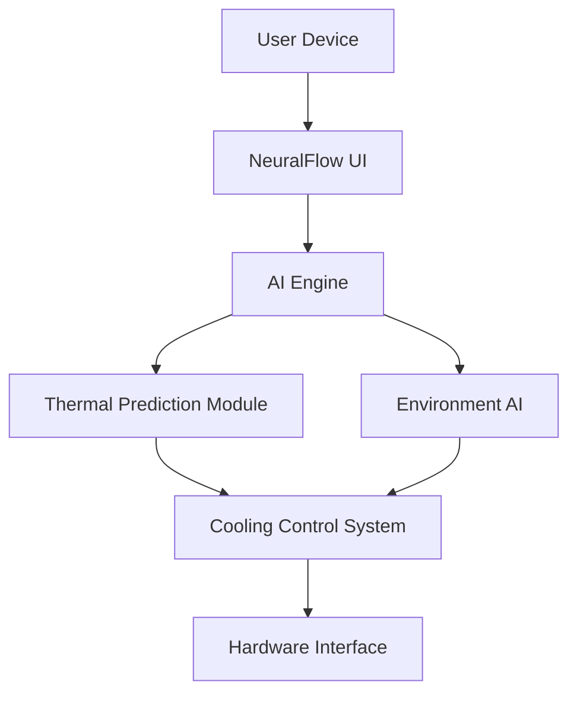

# trend-trackers
NeuralFlow AI is an intelligent system for adaptive cooling and thermal management. It uses AI to monitor CPU usage, predict heat, and optimize performance based on user behavior and environmental data. Features include BRAC cooling, SunSmart AI, and smart task offloading for efficient device health.

Absolutely! Based on the two dashboard images you've uploaded—both showcasing an AI-powered thermal and performance optimization system—I’ll draft a comprehensive technical documentation outline in Markdown format. This will help you present your solution clearly and professionally.

---

## 📘 Technical Documentation: NeuralFlow AI System

### 1. 🧠 Approach & Uniqueness

NeuralFlow AI combines **Bio-Rhythm Adaptive Cooling (BRAC)**, **SunSmart AI**, and **Predictive Thermal Management** to deliver a next-gen intelligent cooling and performance optimization system. What sets it apart:

- **Bio-Rhythm Integration**: Adjusts cooling based on user activity cycles.
- **Environmental Awareness**: Uses real-time weather and location data to optimize thermal behavior.
- **Smart Task Offloading**: Dynamically redistributes workloads across CPU, GPU, and TPU to reduce thermal stress.
- **AI Learning Mode**: Continuously analyzes usage patterns to improve efficiency.

---

### 2. 🛠 Technical Stack

| Component | Technology | Link |
|----------|------------|------|
| Frontend UI | React.js + Tailwind CSS | [React](https://reactjs.org), [Tailwind](https://tailwindcss.com) |
| Backend | Node.js + Express | [Node.js](https://nodejs.org), [Express](https://expressjs.com) |
| AI Engine | Python + TensorFlow | [TensorFlow](https://www.tensorflow.org) |
| Thermal APIs | Custom C++ modules | — |
| Environment Data | OpenWeatherMap API | [OpenWeatherMap](https://openweathermap.org/api) |
| Device Interface | Android HAL / Windows WMI | [Android HAL](https://source.android.com/devices/hal), [Windows WMI](https://learn.microsoft.com/en-us/windows/win32/wmisdk/wmi-start-page) |

---

### 3. 🏗 Architecture Overview



- **NeuralFlow UI**: Interactive dashboard for monitoring and control.
- **AI Engine**: Core logic for predictive analysis and optimization.
- **Thermal Prediction Module**: Estimates future heat output.
- **Environment AI**: Adjusts based on location, weather, and UV index.
- **Cooling Control System**: Executes cooling strategies.
- **Hardware Interface**: Communicates with device sensors and actuators.

---

### 4. ⚙️ Implementation Details

- **BRAC System**: Uses circadian rhythm models to anticipate user activity and preemptively cool.
- **SunSmart AI**: Adjusts cooling based on UV index and ambient temperature.
- **Smart Task Offloading**: Monitors component temperatures and shifts workloads accordingly.
- **Learning Mode**: Trains on historical usage data to improve future predictions.

---

### 5. 📦 Installation Instructions

#### For Windows
```bash
git clone https://github.com/your-repo/neuralflow-ai
cd neuralflow-ai
npm install
npm run start
```

#### For Android (System App)
- Flash the APK via ADB:
```bash
adb install neuralflow-ai.apk
```
- Grant necessary permissions:
```bash
adb shell pm grant com.neuralflow.ai android.permission.ACCESS_FINE_LOCATION
```

---

### 6. 📖 User Guide

#### Dashboard Overview
- **CPU Intelligence**: Monitor core usage and optimize apps.
- **Thermal Control**: Activate cooling modes manually or automatically.
- **Environment AI**: Enable location-based optimization.
- **Smart Task Offloading**: Redistribute workloads to reduce heat.

#### Recommended Usage
- Enable **Auto Environment Mode** for dynamic adjustments.
- Use **Optimize Apps** regularly to maintain performance.
- Monitor **Component Temperature Distribution** for early signs of overheating.

---

### 7. 🌟 Salient Features

- ✅ Real-time thermal prediction
- ✅ Adaptive cooling based on bio-rhythms
- ✅ Location-aware optimization
- ✅ AI-driven workload redistribution
- ✅ Emergency cooldown protocols
- ✅ Network-aware performance tuning

---

### 📸 Screenshots


